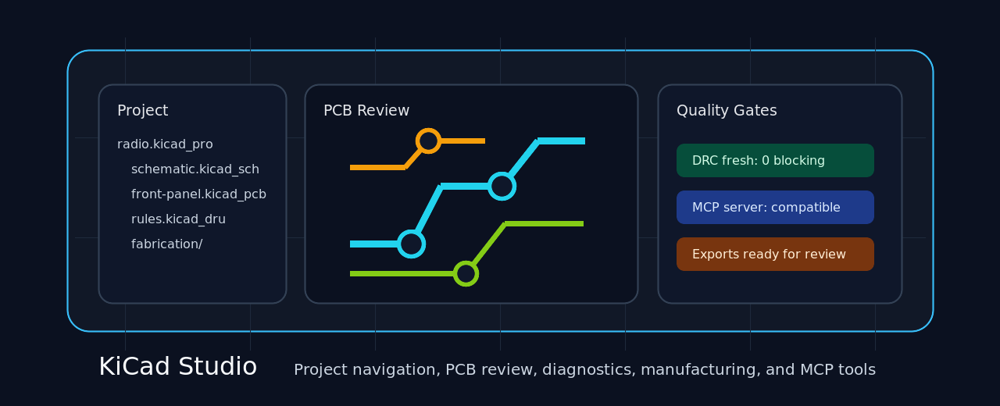
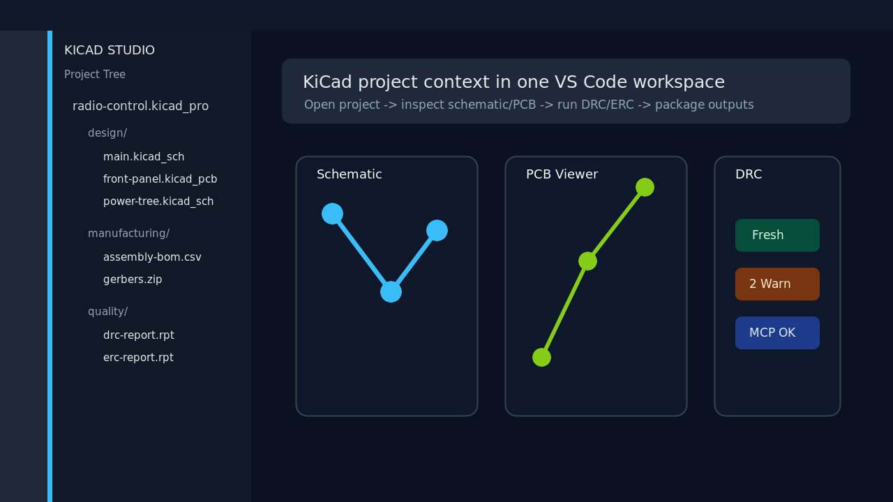
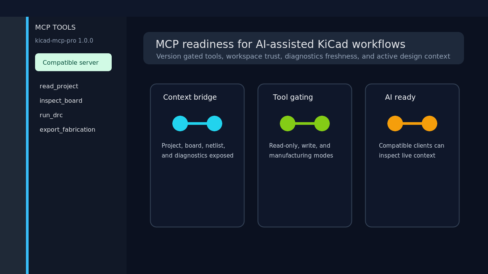
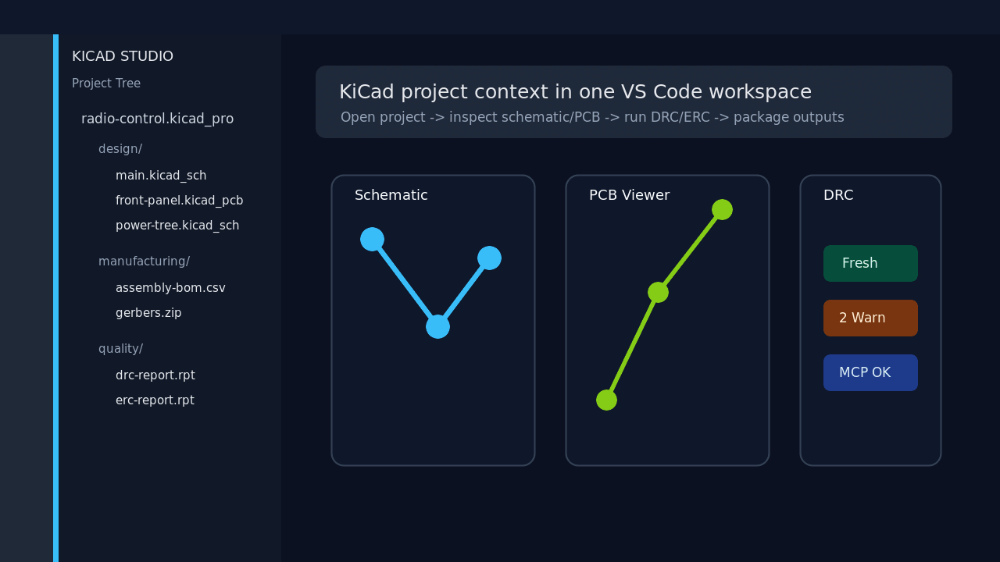

# KiCad Studio

[](https://open-vsx.org/extension/oaslananka/kicadstudiokit)

KiCad Studio turns VS Code into a focused KiCad workspace for project navigation, schematic and PCB inspection, DRC/ERC review, manufacturing handoff, and AI-assisted MCP workflows.

Canonical repository: https://github.com/oaslananka/kicad-studio-kit/tree/main/apps/vscode-extension

- Extension ID: `oaslananka.kicadstudiokit`
- Version: `1.2.0`
- Supported MCP: `kicad-mcp-pro >=3.5.2 <4.0.0`
- Supported KiCad projects: KiCad 8.x, 9.x, and 10.x project, schematic, PCB, DRC, and jobset files

## Quick Start

1. Install **KiCad Studio** from the Visual Studio Marketplace or Open VSX.
2. Open a folder that contains a `.kicad_pro`, `.kicad_sch`, or `.kicad_pcb` file.
3. Run **KiCad: Detect kicad-cli** from the Command Palette if KiCad is not already on `PATH`.
4. Open a schematic or PCB file to use the built-in KiCad Studio viewer.
5. Run **KiCad: Run DRC** or **KiCad: Run ERC** to populate Problems, status, and validation views.
6. Optional: start `kicad-mcp-pro` and connect your AI client with the generated `.vscode/mcp.json` schema.

```powershell
corepack enable
corepack pnpm run dev:doctor
corepack pnpm install --frozen-lockfile
corepack pnpm --filter kicadstudiokit run build
corepack pnpm --filter kicadstudiokit run package
```

## Feature Matrix

| Workflow                  | KiCad Studio                                                                                         | Notes                                                                     |
| ------------------------- | ---------------------------------------------------------------------------------------------------- | ------------------------------------------------------------------------- |
| Project tree              | Native VS Code sidebar for KiCad projects, boards, schematics, jobsets, rules, and generated outputs | Designed for mixed hardware/software workspaces                           |
| Schematic and PCB viewing | Custom editors with KiCad-aware controls and CLI fallback paths                                      | Keeps source files in VS Code while preserving KiCad as the authority     |
| DRC/ERC review            | Problems integration, freshness state, quality gates, and focused validation views                   | Helps separate fresh failures from stale report files                     |
| BOM, netlist, and exports | Repeatable commands for manufacturing handoff and release review                                     | Pairs with KiCad jobsets and project-specific presets                     |
| MCP tools dashboard       | `kicad-mcp-pro` discovery, version gating, tool status, and AI workflow readiness                    | MCP-dependent commands disable themselves when the server is incompatible |
| Localization              | English and Turkish listing copy with extension string infrastructure                                | Paired with OASLANA-106 localization work                                 |

## Screenshots






## Core Workflow



## KiCad CLI-Only Comparison

| Workflow             | KiCad CLI-only                                                     | KiCad Studio                                                                  |
| -------------------- | ------------------------------------------------------------------ | ----------------------------------------------------------------------------- |
| Open project context | Requires remembering paths, commands, and output locations         | Sidebar discovers KiCad project structure inside the active VS Code workspace |
| Inspect design state | Exports or external KiCad windows are needed for most review loops | Schematic and PCB custom editors keep review context next to source changes   |
| Run DRC/ERC          | Terminal output and report files must be correlated manually       | Problems, validation views, and quality gates show actionable diagnostics     |
| Share AI context     | Scripts must manually expose project files and tool capabilities   | MCP dashboard gates compatible `kicad-mcp-pro` tools and workspace context    |

## MCP Compatibility

KiCad Studio 1.2.0 supports `kicad-mcp-pro >=3.5.2 <4.0.0` and was tested against `3.5.2`. If a connected server reports a version outside the required range, MCP-dependent commands are disabled while KiCad-only features continue to work.

## Marketplace Listing Copy

The manual Marketplace and Open VSX checklist, English short/long listing copy, and Turkish localized copy live in [docs/marketplace-listing.md](docs/marketplace-listing.md).

## Release Notes

Release notes for Marketplace and Open VSX users live in [CHANGELOG.md](CHANGELOG.md).

## Local Development

```powershell
corepack pnpm run dev:doctor -- --ci
corepack pnpm install --frozen-lockfile
corepack pnpm --filter kicadstudiokit run marketplace:check
corepack pnpm --filter kicadstudiokit run build
corepack pnpm --filter kicadstudiokit run package
```

## Marketplace Dry Run

```powershell
corepack enable
corepack pnpm install --frozen-lockfile
corepack pnpm --filter kicadstudiokit run marketplace:check
corepack pnpm --filter kicadstudiokit run build
corepack pnpm --filter kicadstudiokit run package
corepack pnpm --filter kicadstudiokit exec vsce ls --tree --no-dependencies
```

## Support and Sponsorship

Use GitHub Issues for reproducible bugs, feature requests, Marketplace rendering problems, and KiCad compatibility reports. Include the KiCad version, operating system, extension version, and the command or file type that reproduced the issue.

Commercial users who rely on KiCad Studio for release, manufacturing, or AI-assisted review workflows can sponsor continued development through the repository sponsor links and support channels.
